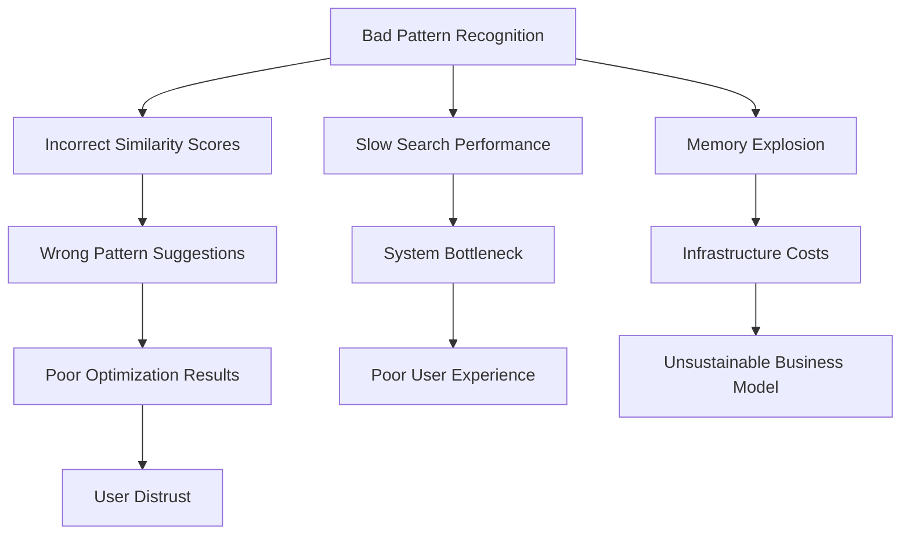
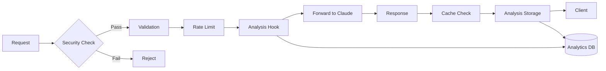
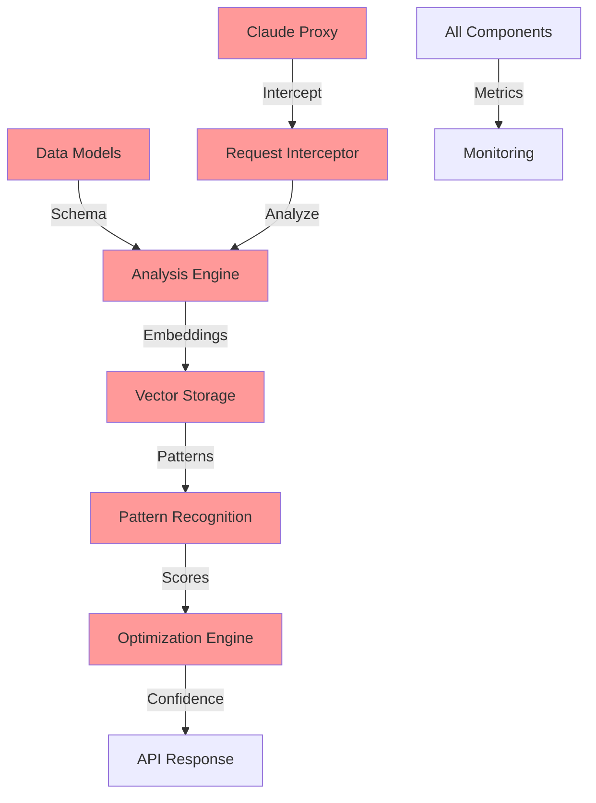

# Deep Analysis of Critical Components in PromptOptima

## CRITICAL PATH 1: Analysis Engine Core

### 2.1.3 Pattern Recognition Engine

**Technical Complexity:**
```
Core Components:
├── Embedding Generation (transformer models)
├── Vector Similarity Search (cosine, euclidean)
├── Pattern Clustering (k-means, DBSCAN)
├── Index Management (HNSW, IVF)
└── Model Versioning System
```

**Critical Implementation Decisions:**

1. **Embedding Model Selection**
   ```python
   # Option A: OpenAI Ada-2 (1536 dimensions)
   pros: High quality, well-tested
   cons: API dependency, cost per embedding
   
   # Option B: Sentence-BERT (384-768 dimensions)
   pros: Self-hosted, customizable
   cons: Requires GPU, maintenance overhead
   
   # Option C: Hybrid approach
   pros: Flexibility, fallback options
   cons: Complexity, consistency challenges
   ```

   **Early Benchmarking Strategy (Phase 1):**
   ```typescript
   interface EmbeddingMetrics {
     latency: number;
     quality: number;
     cost: number;
     scalability: number;
   }
   
   class EmbeddingBenchmark {
     private models: Map<string, EmbeddingModel>;
     
     constructor() {
       this.models = new Map([
         ['ada-2', new OpenAIEmbedding()],
         ['sentence-bert', new SentenceBERT()],
         ['e5-large', new E5LargeEmbedding()]
       ]);
     }
     
     async benchmarkPhase1(): Promise<Map<string, EmbeddingMetrics>> {
       // Run during infrastructure setup
       const metrics = new Map<string, EmbeddingMetrics>();
       
       for (const [name, model] of this.models) {
         metrics.set(name, {
           latency: await this.measureLatency(model),
           quality: await this.measureQuality(model),
           cost: this.calculateCost(model),
           scalability: await this.testScalability(model)
         });
       }
       
       return this.recommendModel(metrics);
     }
   }
   ```

2. **Vector Index Architecture**
   ```yaml
   Performance Requirements:
   - 1M+ vectors indexed
   - <10ms search latency
   - 95%+ recall accuracy
   
   Index Options:
   - HNSW: Best recall, memory intensive
   - IVF: Good compression, slightly slower
   - LSH: Fast but lower accuracy
   ```

**Downstream Effects of Poor Implementation:**



**Risk Mitigation Strategy:**

```typescript
interface PatternRecognitionConfig {
  embedding: {
    model: 'ada-2' | 'sentence-bert' | 'custom';
    dimensions: number;
    version: string;
    fallback: EmbeddingConfig;
  };
  
  search: {
    algorithm: 'hnsw' | 'ivf' | 'flat';
    parameters: {
      efConstruction?: number;  // HNSW
      nlist?: number;           // IVF
      nprobe?: number;          // IVF
    };
    cache: {
      ttl: number;
      maxSize: number;
    };
  };
  
  validation: {
    minimumSimilarity: number;
    maxResults: number;
    qualityThreshold: number;
  };
}
```

### 2.1.4 Multi-dimensional Analysis Framework

**Architecture Design:**

```typescript
interface AnalysisFramework {
  dimensions: {
    speed: SpeedAnalyzer;
    tokens: TokenAnalyzer;
    accuracy: AccuracyAnalyzer;
  };
  
  aggregation: {
    weights: DynamicWeights;
    normalization: NormalizationStrategy;
    confidence: ConfidenceCalculator;
  };
  
  pipeline: AnalysisPipeline[];
}
```

**Critical Weight Calculation:**

```typescript
// Wrong approach - static weights
const score = 0.33 * speed + 0.33 * tokens + 0.34 * accuracy;  // Bad!

// Correct approach - context-aware weights
function calculateWeights(context: PromptContext): Weights {
  if (context.useCase === "real_time") {
    return { speed: 0.6, tokens: 0.2, accuracy: 0.2 };
  } else if (context.useCase === "batch_processing") {
    return { speed: 0.2, tokens: 0.3, accuracy: 0.5 };
  } else {
    return adaptiveWeights(context);
  }
}

// Enhanced: Dynamic Weighting with Real-time Analytics
interface WeightHistoryEntry {
  context: PromptContext;
  weights: Weights;
  timestamp: Date;
}

class AdaptiveWeightingStrategy {
  private weightHistory: CircularBuffer<WeightHistoryEntry>;
  private performanceTracker: PerformanceTracker;
  
  constructor() {
    this.weightHistory = new CircularBuffer<WeightHistoryEntry>(1000);
    this.performanceTracker = new PerformanceTracker();
  }
  
  async calculateAdaptiveWeights(context: PromptContext): Promise<Weights> {
    // Base weights from context
    const baseWeights = this.getBaseWeights(context);
    
    // Adjust based on recent performance
    const performanceData = await this.performanceTracker.getRecent({ hours: 24 });
    
    // Dynamic adjustment criteria
    const adjustments = {
      speed: this.calculateSpeedAdjustment(performanceData),
      tokens: this.calculateTokenAdjustment(performanceData),
      accuracy: this.calculateAccuracyAdjustment(performanceData)
    };
    
    // Apply adjustments with constraints
    const finalWeights = this.applyAdjustments(baseWeights, adjustments);
    
    // Track for future learning
    this.weightHistory.push({
      context,
      weights: finalWeights,
      timestamp: new Date()
    });
    
    return finalWeights;
  }
}
```

**Downstream Effects:**

1. **Incorrect Weightings**
   - Speed-optimized prompts for accuracy-critical tasks
   - Token-heavy optimizations when cost is critical
   - Misleading "improvement" metrics

2. **Inflexible Design**
   - Cannot add new dimensions (e.g., security, complexity)
   - Hard-coded assumptions throughout codebase
   - Unable to A/B test different strategies

**Implementation Best Practices:**

```typescript
class AnalysisFramework {
  private analyzers: Map<string, Analyzer>;
  private aggregator: WeightedAggregator;
  
  analyze(prompt: Prompt, context: Context): Analysis {
    // 1. Run parallel analysis
    const results = await Promise.all(
      Array.from(this.analyzers.entries()).map(([name, analyzer]) =>
        this.runWithTimeout(analyzer.analyze(prompt), name)
      )
    );
    
    // 2. Validate results
    const validated = results.map(r => this.validate(r));
    
    // 3. Calculate weighted score
    const weights = this.aggregator.calculateWeights(context);
    const score = this.aggregator.aggregate(validated, weights);
    
    // 4. Generate confidence
    const confidence = this.calculateConfidence(validated, weights);
    
    return { score, breakdown: validated, confidence };
  }
}
```

## CRITICAL PATH 2: Claude API Integration

### 2.2.1 Claude API Proxy

**Latency Budget Breakdown:**

```
Total Budget: 50ms
├── Request Parsing: 2ms
├── Authentication: 3ms
├── Analysis Hook: 5ms
├── Request Forwarding: 30ms
├── Response Processing: 5ms
├── Logging/Metrics: 3ms
└── Buffer: 2ms
```

**Critical Design Patterns:**

1. **Circuit Breaker Implementation**
   ```typescript
   class ClaudeProxy {
     private circuitBreaker = new CircuitBreaker({
       timeout: 30000,
       errorThresholdPercentage: 50,
       resetTimeout: 30000
     });
     
     async forward(request: ProxyRequest): Promise<ProxyResponse> {
       return this.circuitBreaker.fire(async () => {
         const start = Date.now();
         
         try {
           // Pre-processing hooks
           await this.preProcess(request);
           
           // Forward with timeout
           const response = await this.httpClient.post({
             timeout: 25000,  // Less than circuit breaker
             ...request
           });
           
           // Post-processing hooks
           await this.postProcess(response);
           
           return response;
         } catch (error) {
           // Enhanced: Structured error logging
           this.logger.error({
             timestamp: new Date().toISOString(),
             request_id: request.id,
             error_type: error.constructor.name,
             error_message: error.message,
             stack_trace: error.stack,
             api_version: this.apiVersion,
             context: {
               endpoint: request.endpoint,
               method: request.method,
               user_id: request.userId
             }
           });
           throw error;
         } finally {
           this.metrics.recordLatency(Date.now() - start);
         }
       });
     }
     
     // Enhanced: Automated API Compatibility Testing
     async checkApiCompatibility(): Promise<void> {
       const compatibilityTests = [
         this.testEndpointAvailability(),
         this.testResponseFormat(),
         this.testRateLimits(),
         this.testErrorHandling()
       ];
       
       const results = await Promise.all(compatibilityTests);
       
       if (results.some(r => !r.compatible)) {
         this.notifyOpsTeam({
           type: 'API_COMPATIBILITY_ISSUE',
           results,
           timestamp: new Date()
         });
       }
     }
   }
   ```

2. **Request Queuing Strategy**
   ```typescript
   interface QueueStrategy {
     priority: 'fifo' | 'lifo' | 'priority' | 'fair';
     maxConcurrent: number;
     maxQueueSize: number;
     timeout: number;
     
     // Critical: Prevent memory explosion
     evictionPolicy: 'oldest' | 'lowest_priority';
     
     // Critical: Handle backpressure
     backpressure: {
       threshold: number;
       action: 'reject' | 'throttle' | 'redirect';
     };
   }
   ```

**Downstream Effects of Poor Implementation:**

```yaml
High Latency:
  - User Impact: Perceived slowness, timeouts
  - System Impact: Request queue buildup
  - Business Impact: User churn, bad reviews

Poor Error Handling:
  - Cascading Failures: One bad request affects many
  - Data Loss: Responses not properly logged
  - Debugging Hell: Can't trace issues

Bad Abstraction:
  - Vendor Lock-in: Tightly coupled to Claude API
  - Upgrade Difficulty: Can't adapt to API changes
  - Feature Limitations: Can't add provider-specific features
```

### 2.2.3 Request/Response Interceptors

**Security-First Design:**

```typescript
class InterceptorChain {
  private interceptors: Interceptor[] = [
    new SecurityInterceptor(),    // First: Security checks
    new ValidationInterceptor(),  // Second: Input validation
    new RateLimitInterceptor(),   // Third: Rate limiting
    new AnalysisInterceptor(),    // Fourth: Data collection
    new CacheInterceptor(),       // Fifth: Response caching
  ];
  
  async process(context: RequestContext): Promise<void> {
    for (const interceptor of this.interceptors) {
      try {
        await interceptor.process(context);
        
        if (context.shouldStop()) {
          break;
        }
      } catch (error) {
        // Critical: Don't leak sensitive data
        const sanitized = this.sanitizeError(error);
        context.setError(sanitized);
        
        if (!interceptor.optional) {
          throw sanitized;
        }
      }
    }
  }
}
```

**Critical Data Flow Paths:**



**Performance Considerations:**

```typescript
// BAD: Sequential processing
async function processRequest(req: Request) {
  await logRequest(req);      // 5ms
  await analyzeRequest(req);  // 10ms
  await validateRequest(req); // 3ms
  // Total: 18ms overhead!
}

// GOOD: Parallel where possible
async function processRequest(req: Request) {
  // Critical path only
  await validateRequest(req); // 3ms
  
  // Non-critical in background
  Promise.all([
    logRequest(req),
    analyzeRequest(req)
  ]).catch(handleBackgroundError);
  
  // Total: 3ms overhead
}
```

## CRITICAL PATH 3: Optimization Engine

### 3.1.1 DSPy Integration

**Integration Architecture:**

```typescript
interface ResourceLimits {
  memory: string;
  cpu: string;
  disk: string;
}

class DSPyOptimizer {
  private readonly dspyVersion = "2.4.5";  // Pin specific version
  private strategies: Map<string, OptimizationStrategy>;
  private logger: Logger;
  
  constructor() {
    this.strategies = new Map([
      ['mipro_v2', new MIPROv2Strategy()],
      ['bootstrap', new BootstrapFewShotStrategy()],
      ['custom', new CustomStrategy()]
    ]);
  }
  
  async optimize(prompt: Prompt, strategy: string): Promise<OptimizedPrompt> {
    // Critical: Isolation with resource monitoring
    const sandbox = await this.createSandbox();
    
    try {
      // Configure resource limits and monitoring
      await sandbox.setLimits({
        memory: '2GB',
        cpu: '2 cores',
        disk: '1GB'
      });
      
      // Enhanced: Resource monitoring
      const monitor = new ResourceMonitor(sandbox);
      await monitor.track(['memory', 'cpu', 'io']);
      
      // Run in isolated environment
      const result = await sandbox.run(
        this.strategies.get(strategy)!,
        prompt,
        { timeout: 30000 }  // 30 seconds
      );
      
      // Check for resource issues
      const resourceReport = await monitor.getReport();
      if (resourceReport.hasIssues()) {
        this.logger.warn('Resource issues detected', resourceReport);
      }
      
      // Critical: Validation
      if (!this.validateResult(result)) {
        throw new OptimizationError("Invalid optimization result");
      }
      
      return result;
    } finally {
      await sandbox.cleanup();
    }
  }
}
```

**Critical Failure Modes:**

1. **Version Mismatch**
   ```yaml
   Problem: DSPy updates breaking changes
   Impact: 
     - Optimizations fail silently
     - Incorrect results returned
     - Production outages
   
   Solution:
     - Pin exact versions
     - Automated compatibility testing
     - Gradual rollout strategy
   ```

2. **Resource Exhaustion**
   ```typescript
   // DSPy can be resource intensive
   interface ResourceConfig {
     memory: string;
     cpu: string;
     time: string;
   }
   
   class ResourceManager {
     private limits: ResourceConfig = {
       memory: '2GB',
       cpu: '2 cores',
       time: '30s'
     };
     
     async runOptimization<T>(
       func: (...args: any[]) => Promise<T>,
       ...args: any[]
     ): Promise<T> {
       const controller = new ResourceController(this.limits);
       
       try {
         await controller.start();
         return await func(...args);
       } finally {
         await controller.stop();
       }
     }
   }
   ```

### 3.1.4 Optimization Confidence Scoring

**Confidence Calculation Framework:**

```typescript
interface ConfidenceFactors {
  // Historical performance
  historicalAccuracy: number;      // 0-1
  sampleSize: number;              // affects weight
  
  // Optimization metrics
  improvementMagnitude: number;     // % improvement
  consistencyAcrossRuns: number;   // variance
  
  // Context similarity
  similarityToTrainingData: number; // 0-1
  domainMatch: number;             // 0-1
  
  // Validation results
  testCoverage: number;            // 0-1
  edgeCasePerformance: number;     // 0-1
}

class ConfidenceCalculator {
  calculate(factors: ConfidenceFactors): ConfidenceScore {
    // Critical: Avoid overconfidence
    const rawScore = this.weightedAverage(factors);
    
    // Apply penalties for uncertainty
    const penalties = [
      this.sampleSizePenalty(factors.sampleSize),
      this.domainMismatchPenalty(factors.domainMatch),
      this.variancePenalty(factors.consistencyAcrossRuns)
    ];
    
    const penalizedScore = rawScore * penalties.reduce((a, b) => a * b);
    
    // Critical: Never exceed reasonable bounds
    return {
      score: Math.min(penalizedScore, 0.95), // Never 100% confident
      factors: factors,
      explanation: this.generateExplanation(factors, penalties)
    };
  }
}
```

**Calibration Requirements:**

```typescript
// Critical: Confidence must match actual performance
interface CalibrationBucket {
  min: number;
  max: number;
  midpoint: number;
}

class ConfidenceCalibrator {
  // If confidence says 80%, then 80% of predictions should actually be correct
  async calibrateConfidence(historicalData: HistoricalPrediction[]): Promise<void> {
    const buckets = this.createConfidenceBuckets(0.1);  // 0-10%, 10-20%, etc.
    
    for (const bucket of buckets) {
      const predictions = historicalData.filter(
        x => bucket.min <= x.confidence && x.confidence < bucket.max
      );
      
      const actualAccuracy = this.calculateAccuracy(predictions);
      const expectedAccuracy = bucket.midpoint;
      
      const calibrationError = Math.abs(actualAccuracy - expectedAccuracy);
      
      if (calibrationError > 0.05) {  // 5% tolerance
        await this.adjustConfidenceModel(bucket, actualAccuracy);
      }
    }
  }
  
  // Enhanced: Schedule regular calibration sessions
  async scheduleCalibration(): Promise<void> {
    // Run calibration quarterly
    this.scheduler.schedule('0 0 1 */3 *', async () => {
      const data = await this.getHistoricalData({ months: 3 });
      await this.calibrateConfidence(data);
      
      // Notify team of calibration results
      await this.notifyCalibrationComplete({
        date: new Date(),
        samplesProcessed: data.length,
        adjustmentsMade: this.getAdjustmentCount()
      });
    });
  }
}
```

## CRITICAL PATH 4: Data Layer Architecture

### 2.3.1 Data Models Design

**Schema Design Principles:**

```sql
-- Critical: Versioning from day one
CREATE TABLE prompts (
    id UUID PRIMARY KEY,
    version INTEGER NOT NULL DEFAULT 1,
    created_at TIMESTAMPTZ NOT NULL,
    updated_at TIMESTAMPTZ NOT NULL,
    
    -- Critical: Separate mutable/immutable
    content TEXT NOT NULL,              -- Immutable
    content_hash VARCHAR(64) NOT NULL,  -- For deduplication
    
    -- Metadata can evolve - Enhanced: Semi-structured for flexibility
    metadata JSONB NOT NULL DEFAULT '{}',
    
    -- Enhanced: Flexible schema for future enhancements
    extended_metadata JSONB DEFAULT '{}',  -- For evolving requirements
    
    -- Critical: Soft deletes
    deleted_at TIMESTAMPTZ,
    
    -- Critical: Audit trail
    created_by UUID REFERENCES users(id),
    updated_by UUID REFERENCES users(id)
);

-- Critical: Separate analysis results (can recompute)
CREATE TABLE analyses (
    id UUID PRIMARY KEY,
    prompt_id UUID REFERENCES prompts(id),
    analyzer_version VARCHAR(20) NOT NULL,  -- Critical: Track version
    
    -- Scores as separate columns for indexing
    speed_score DECIMAL(5,2),
    token_score DECIMAL(5,2),
    accuracy_score DECIMAL(5,2),
    overall_score DECIMAL(5,2),
    
    -- Detailed results in JSON
    details JSONB NOT NULL,
    
    -- Critical: Caching strategy
    computed_at TIMESTAMPTZ NOT NULL,
    expires_at TIMESTAMPTZ,
    
    INDEX idx_analyses_scores (overall_score, computed_at)
);
```

**Migration Strategy:**

```typescript
class MigrationManager {
  // Critical: Zero-downtime migrations
  async migrate(migration: Migration) {
    // 1. Create new columns/tables
    await this.addNewStructures(migration);
    
    // 2. Dual-write period
    await this.enableDualWrites(migration);
    
    // 3. Backfill data
    await this.backfillData(migration, {
      batchSize: 1000,
      sleepBetween: 100, // ms
      validateEach: true
    });
    
    // 4. Verify data integrity
    const valid = await this.verifyMigration(migration);
    if (!valid) {
      throw new Error("Migration validation failed");
    }
    
    // 5. Switch reads to new structure
    await this.switchReads(migration);
    
    // 6. Stop dual writes
    await this.disableDualWrites(migration);
    
    // 7. Clean up old structures (after safety period)
    await this.scheduleCleanup(migration, '7 days');
  }
}
```

### 2.3.4 Vector Embedding Storage

**Storage Architecture:**

```yaml
Vector Storage Design:
  Primary Storage: Weaviate/Qdrant
    - Dimensions: 1536 (OpenAI) or 768 (BERT)
    - Index Type: HNSW
    - Replication: 3x
    
  Backup Storage: PostgreSQL + pgvector
    - For disaster recovery
    - Slower but reliable
    
  Cache Layer: Redis
    - Hot vectors in memory
    - TTL: 1 hour
```

**Critical Implementation Details:**

```typescript
interface VectorStorage {
  // Critical: Version management
  async store(
    vector: Float32Array,
    metadata: VectorMetadata
  ): Promise<VectorId> {
    // 1. Validate dimensions
    if (vector.length !== this.config.dimensions) {
      throw new Error(`Expected ${this.config.dimensions} dimensions`);
    }
    
    // 2. Version tracking
    const versioned = {
      vector: vector,
      metadata: {
        ...metadata,
        model_version: this.config.modelVersion,
        stored_at: new Date(),
        dimensions: vector.length
      }
    };
    
    // 3. Store with retry
    const id = await this.retryableStore(versioned);
    
    // 4. Async backup
    this.backupQueue.add({ id, versioned });
    
    return id;
  }
  
  // Critical: Handle model upgrades
  async search(
    query: Float32Array,
    options: SearchOptions
  ): Promise<SearchResult[]> {
    // Check version compatibility
    if (options.modelVersion !== this.config.modelVersion) {
      // Either reject or use adapter
      if (this.adapters.has(options.modelVersion)) {
        query = await this.adapters.get(options.modelVersion).convert(query);
      } else {
        throw new Error("Incompatible model version");
      }
    }
    
    return this.vectorDB.search(query, options);
  }
}
```

**Performance Optimization:**

```typescript
interface IndexTier {
  name: 'hot' | 'warm' | 'cold';
  index: VectorIndex;
  maxSize: number;
}

class VectorIndexManager {
  private indices: Map<string, VectorIndex>;
  
  constructor() {
    this.indices = new Map([
      ['hot', new HotIndex({ maxSize: 10000 })],     // In-memory
      ['warm', new WarmIndex({ maxSize: 100000 })],  // SSD
      ['cold', new ColdIndex()]                       // Object storage
    ]);
  }
  
  async search(vector: Float32Array, k: number = 10): Promise<SearchResult[]> {
    // Critical: Search hot data first
    const results: SearchResult[] = [];
    
    for (const [indexName, index] of this.indices) {
      const partialResults = await index.search(vector, k);
      results.push(...partialResults);
      
      // Critical: Early termination
      if (results.length >= k && this.qualitySufficient(results)) {
        break;
      }
    }
    
    return this.mergeAndRank(results).slice(0, k);
  }
  
  // Enhanced: Automated index management
  async promoteVector(vectorId: string, fromTier: string, toTier: string): Promise<void> {
    const vector = await this.indices.get(fromTier)!.retrieve(vectorId);
    await this.indices.get(toTier)!.store(vectorId, vector);
    await this.indices.get(fromTier)!.remove(vectorId);
  }
  
  // Enhanced: Automatic hot/warm/cold promotion
  async autoManageIndices(): Promise<void> {
    const accessPatterns = await this.analyzeAccessPatterns();
    
    // Promote frequently accessed vectors to hot tier
    for (const pattern of accessPatterns.frequent) {
      if (pattern.currentTier !== 'hot') {
        await this.promoteVector(pattern.vectorId, pattern.currentTier, 'hot');
      }
    }
    
    // Demote rarely accessed vectors to cold tier
    for (const pattern of accessPatterns.rare) {
      if (pattern.currentTier !== 'cold') {
        await this.promoteVector(pattern.vectorId, pattern.currentTier, 'cold');
      }
    }
  }
}
```

## Cross-Component Critical Interactions



## Critical Success Metrics

1. **Analysis Engine**: <10ms pattern matching with 95% accuracy
2. **Claude Proxy**: <50ms overhead with 99.9% reliability
3. **Optimization**: 40% improvement in prompt quality
4. **Data Layer**: <5ms query time at 1M records
5. **Confidence**: ±5% calibration accuracy

These critical components form the backbone of the system. Their proper implementation is the difference between a successful product and a failed project.